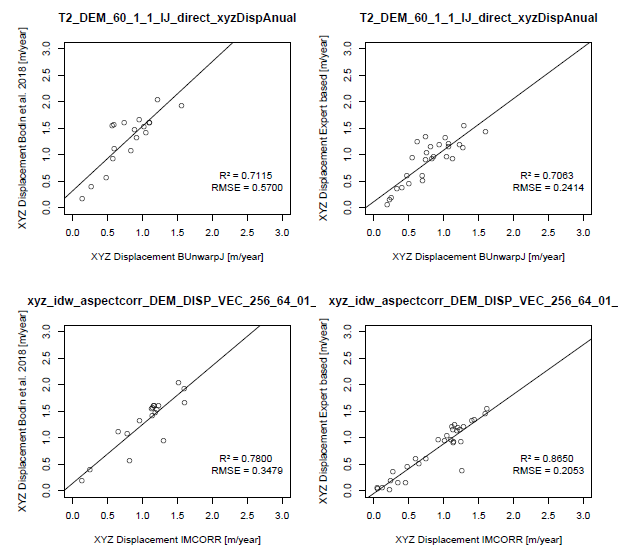

```{r setup, include=FALSE}
knitr::opts_chunk$set(echo = TRUE)
```

\centering
\raggedright
\newpage
\tableofcontents
\newpage


# Introduction

Rock glaciers are distinctive morphological features of high mountain periglacial environments. Their deformation processes are strongly linked to permafrost degradation [@haeberli_mountain_2010]. Thus, research of deformation velocities of rock glaciers does not only provide insights into periglacial morphology but also in time evolution of permafrost. Several authors have used rock glaciers as proxies for permafrost presence/absence in permafrost distribution models [@boeckli_statistical_2012,@marcer_permafrost_2017].

In recent years, multi-method approaches have been used in this field of research; @buchli_kinematic_2018 combine laser scanning, terrestrial radar and in-situ measurements at the Furggwanghorn rock glacier in Switzerland. Remote sensing data, especially radar interferometry (InSAR) [@barboux_mapping_2015], optical imagery and laser scanning [@arenson_detection_2016] have become more and more common for rock glacier deformation analysis. With unmanned aerial vehicles (UAVs), high-resolution consumer grade digital cameras and smartphones being more and more widespread, surveys with high to very high resolution in time and space dimensions [@dallasta_unmanned_2017] become affordable in research and natural hazard mitigation contexts. Structure-from-motion (SfM) [@smith_structure_2016] and other established photogrammetric techniques allow for the generation of genuine 3D point clouds as well as 2.5D digital surface models (DSMs) and derivates, acquired by abovementioned techniques [@eltner_imagebased_2016].

From a series of those surface models at different points in time, displacement velocities of mass movement processes as well as surface changes resulting from erosion and denudation can be quantified. Techniques range from simple DEM differencing to 3-dimensional point-cloud comparison [@james_3d_2017].

Image matching techniques are well established methods for the quantification of surface changes in geomorphology and glaciology [@paul_glaciers_2015]. They have already been developed for glacier velocity analyses in the mid-1980s [@scambos_application_1992] and have been developed further since then. They do not necessarily depend on elevation models, except for the quantification of 3-dimensional (i.e. elevation) differences. All image matching algorithms are based on the comparison of either local image patterns or structures/features, on global image characteristics or a combination thereof. They can be applied to panchromatic or colour images as well as to DEMs and their derivates and image transformations (most commonly used: Fourier transformations, filters and principal component analyses) [@heid_evaluation_2012,@dallasta_unmanned_2017]. Besides scope and input data, image matching algorithms can be structured by their similarity measure: The calculation of a normalized cross-correlation coefficient (NCC) on two image parts is the most widespread mesaure [@scambos_application_1992]. More recently, NCC-based similarity measures have been developed further, being based on image derivatives [@heid_evaluation_2012] or on global energy functions [@argandacarreras_consistent_2006].

Image matching techniques have been applied to rock glacier deformation detection and the calculation of velocity fields. @bodin_multi-annual_2018 present one of the most recent examples for the Laurichard rock glacier in the French Alps. Based on their work, we compared the performance of two image matching algorithms for surface displacement detection between 2012 and 2017: 
1. The well-established IMCORR algorithm [@nsidc_imcorr_2018], based on @scambos_application_1992; and 
2. bUnwarpJ, a semi-global algorithm originally developed for image registration in health studies [@argandacarreras_consistent_2006].
For both algorithms we calculated an annual displacement rate of the Laurichard rock glacier, based on high-resolution DEMs from an aerial laser scanning campaign in 2012 and from a UAV campaign in 2017. We optimized parameter settings of both approaches and estimated the accuracy of the resulting deformation fields with GPS displacement data from @bodin_multi-annual_2018 and manually mapped surface displacements.

TODO: Structure of the paper? 

# Study Area

The Laurichard rock glacier is situated in the French Alps, with an approximately 800m long and 100-200m wide tounge flowing from south to north-east. Due to its morphological features it can be considered an active rock glacier [@bodin_multi-annual_2018]. Especially, hillshades generated from available digital elevation models (DEMs) exhibit scarps, oriented perpendicular to the flow direction as well as a steep rising frontal lobe.

Since the beginning of the 1980s, the Laurichard rock glacier has been subject to in-situ and remote sensing photogrammetry research. Refer to @bodin_multi-annual_2018 for the most current research work as well as for an overview over the history of site studies.

```{r echo=FALSE, fig.pos="h",fig.align="center", out.width = "300px", fig.cap= "Study Site: Laurichard rock glacier is situated in the French Alps"}
knitr::include_graphics("images/Map_1.png")
```

# Data and Methods


## Used Data

* Two DEM's with different Generation methods
  + 2017 SFMMVS (Structure from Motion)
  + 2012 LIDAR
  + both Resolution of 0.1 m
  + co-registered
* Different Derivates (Hillshade, Aspect, Slope, PC1 (PCA of DEM, Hillshade, Aspect and Slope))
* Validation Data (XYZ Displacement 2012-2015) Bodin et al. 2017
* Expert Based Validation Dataset (Points from ImageJ (Source, Target), Calculate euclidian Distanz -> Calculate XYZ Displacment (Extract Height from Source Image at Source Point, Target Image at Target Point, Make difference (TargetHeight- SourceHeight, Calcilate XYZ with sqrt((XY_Displacement)^2 +(Z_Displacement)^2))) )
* ContourShapefile
* Software
  + Fiji ImageJ 1.52d , Plugin BunwarpJ 2.6 
  + R version 3.4.4 and R Studio Version 1.1.453 
  + IMCORR XYXYXYXYXYXYXYXYX


Jason Goetz (personal communication). [!]

## IMCORR

## ImageJ BUnwarpJ

* performs "2D image registstration based on elastic deformation" represented by B-splines
* performs a simultaneous registration of two Images
* Algortihm 
  + based on the minimazation of an enegry functional, that includes the dissimilarity between the Source and the Target image (in both directions, $E_{img}$ )
  + an optional landmark constraint $E_\mu$
  + a regularization term ($E_{div} + E_{rot}$)
  + a energy term ($E_{cons}$) (accounts for the geometricaly consistancy for the elastic deformation in both directions)
  + $\omega$ alias weight is set by the user
  + the optimizatuon process is a Levenberg-Marquardt minimization, enhanced by a Broyden-Fletcher-Goldfarb-Shanno (BFGS) estimate of the local Hessian of the goal Function
  + both images and deformations are represented by cubic B-splines
  + https://imagej.net/BUnwarpJ
  + https://af13436f-a-62cb3a1a-s-sites.googlegroups.com/site/iargandacarreras/bUnwarpJ_ImageJ_Conf_2008_presentation.pdf?attachauth=ANoY7cpXgp6aXFHcp0y-7ye8MZR1eldVpbnrG-K5zSjqzO-E_8FDSPbrmNLvdyTOIBUhOb3NXzKtQ4gAAYkqT1TCt6psT3QnugWziKk7EyhA-2iiqUpIS0W5R8KIvyFHwqzb6Y4WEe7xOe5qDW1IUhTu1dDNWKSzLQfzaplbeJe4UFFQwqyPceD64SLslK9JQSsKK5pJ-LTKy5nMjFP8F8mtI4UJgf3BAdZy9aZgrvm_HvSZPjnYlADN1SHAL2mymvTW5x5frOHO&attredirects=0
 
 $$E=\omega_{i\ }E_{img}\ +\ \omega_{\mu}\ E_{\mu}\ +\left(\omega_{d\ }E_{div}\ +\omega_{r\ }E_{rot}\right)\ +\omega_{c\ }E_{cons}$$

## Test Setup

* Decision to to test with ImageJ (time)
* Masking Aspect und Mask, causes the loss of Validation points (NA)
* Test setup
  + Test I: Testing the difference of Landmarks (60/61), landmark on falling rock (yes/no), see map for study site, decision which Landmarks we gonna use
  + Test II: Testing Different Input Data (DEM,HILL,ASPECT,SLOPE;PCA1) for Transformation BunwarpJ, all applied to DEM, decision which input data  we gonna use for Transformation
  + Test III: Testing different Setting, Name LMW/IMW (Landmarkweight/imageweight), decision final processing settings
  + Test IV: three different Settings for IMCORR, to much time, future research sample TestSetup like bunwrappJ (with out Landmarks)

# Results

## Test I

Testing the influnce of extreme Values (falling Rocks) towards the image machings technics, Landmarks for Transformation and the correlation to the validiaton data set

* The Test Results are showing
  + Validiation with Bodin
    + 60 LM XYZ Correlation and RMSE (R² = 0.7115, RMSE = 0.57)
    + 61 LM XYZ Correlation and RMSE (R² = 0.0499, RMSE = 0.847)
  + Validation with expert based Valdidation Points
    + 60 LM XYZ Correlation and RMSE (R² = 0.7063, RMSE = 0.2414)
    + 61 LM XYZ Correlation and RMSE ( R² = 0.5892, RMSE = 0.291)
* I thing here we dont have to pay attention to the min max and so on, i think we shoot look on that at the final results
* Explenation and drawing conclusion see diskussion

\newpage

```{r packages-tab2,echo=FALSE, warning=FALSE, message=FALSE}
library(dplyr)
library(knitr)
library(kableExtra)
text_tbl = read.csv(file = "tables/T1_DEM_60_61_xyz_Bodin_manuell.csv",header = T,sep = ";")
 knitr::kable(text_tbl, format = "latex", booktabs = TRUE, caption = "Result Statistics Test I") %>% 
    kableExtra::kable_styling(full_width = F, font_size = 10 , latex_options = c("striped","hold_position","scale_down"))%>%
   column_spec(1, bold = TRUE, width = "2cm") %>%  #color = "blue"
   column_spec(2, width = "2.5cm") %>%
   column_spec(3:6, width = "3cm") %>%
   row_spec(0, bold = TRUE) %>%
   row_spec(1, bold = TRUE) %>%
   row_spec(12:13, bold = TRUE) %>%
   row_spec(16, bold = TRUE) %>%
   row_spec(27:28, bold = TRUE)
   
```

\newpage

```{r echo=FALSE, fig.pos="h",fig.align="center", out.width = "500px", fig.cap= "Influence of extreme Landmarks"}
knitr::include_graphics("images/Map_2.png")
```

\newpage

## Test II 

Testing different input Data for Transformation Creation with 60 Landmark, Result from Test 1, not sure if we really need the "Error" in all the tables

* The Results are showing
  + Valdidation Bodin
    + Aspect ( R² = 0.4926, RMSE = 0.6555) and Slope ( R² = 0.5379, RMSE = 0.5881) are not really suitable to Create the Transformation ( make sense)
    + Hillshade ( R² = 0.6802, RMSE = 0.5656) and PC1 ( R² = 0.6322, RMSE = 0.5211) are showing nearly identical Results, can be used
    + DEM (R² 0.7115, RMSE = 0.57) is the best option (but not significant)
  + Exepert Based
    + Aspect (R² = 0.5637, RMSE = 0.3162) and Slope ( R² = 0.5594, RMSE = 0.32) are not really suitable to Create the Transformation ( make sense)
    + Hillshade (R² = 0.6099, RMSE = 0.3056), less accourate than bodin
    + DEM (R² = 0.7063, RMSE = 0.2414) and PC1(R²0.681, RMSE = 0.2585) are showing nearly identical Results, both can ne used
* I thing here we dont have to pay attention to the min max and so on, i think we shoot look on that at the final results
* Explenation and drawing conclusion see diskussion


```{r packages-tab3,echo=FALSE, warning=FALSE, message=FALSE}
library(dplyr)
library(knitr)
library(kableExtra)
text_tbl = read.csv(file = "tables/T2_diff_input_60_XYZ_bodin_manuell.csv",header = T,sep = ";")
 knitr::kable(text_tbl, format = "latex", booktabs = TRUE, caption = "Resulting Statistics Test II") %>% 
    kableExtra::kable_styling(full_width = F, font_size = 10 , latex_options = c("striped","hold_position","scale_down"))%>%
   column_spec(1, bold = TRUE, width = "2cm") %>%  #color = "blue"
   column_spec(2, width = "2.5cm") %>%
   column_spec(3:12, width = "3cm") %>%
   row_spec(0, bold = TRUE) %>%
   row_spec(1, bold = TRUE) %>%
   row_spec(12:13, bold = TRUE) %>%
   row_spec(16, bold = TRUE) %>%
   row_spec(27:28, bold = TRUE) %>%
   kableExtra::landscape()
   
```

## Test III

Testing different Settings of ImageJ, the Seetings are part of the Name -> Bsp. T3_DEM_60_[4_1]xyzDispAnual, the 4 is the Landmarkweight and the 1 The image weight

* The Results show
  + tested combinations, 4_1,2_1,1_1,1_0,0_0,0_1,0_2,0_4, in gernerall
    + combination 0_0 = useless
    + combination 0_1 = also useless (Standart Setting of Bunwarp)
    + combination 1_[2:4] = more or less useless
    + combinaiton [2:4]_1 = showing good results
    + combination 1_1 = showing best results, nealy as good as [2:4]_1
  + Trends:
    + better results for 1_2 or 2_1 Settings in comparison to 1_4 and 4_1
    + Landmarkweight (4_1,2_1) showing significant better results than Imageweight
    + Trade of beetween LMW and IMW (1_1), is showing the best result
  + conclusion:
    + Use 1_1 (or high landmarkweight is also ok)
  + RMSE of Expert based Validition is lower than Bodin ( Test 1,2 confirmed)
  
* I thing here we dont have to pay attention to the min max and so on, i think we shoot look on that at the final results
* Explenation and drawing conclusion see diskussion

```{r packages-tab4,echo=FALSE, warning=FALSE, message=FALSE}
library(dplyr)
library(knitr)
library(kableExtra)
text_tbl = read.csv(file = "tables/T3_Settings_XYZ_Bodin_manuell.csv",header = T,sep = ";")
 knitr::kable(text_tbl, format = "latex", booktabs = TRUE, caption = "Resulting Statistics Test III") %>% 
    kableExtra::kable_styling(full_width = F, font_size = 10 , latex_options = c("striped","hold_position","scale_down"))%>%
   column_spec(1, bold = TRUE, width = "2cm") %>%  #color = "blue"
   column_spec(2, width = "2.5cm") %>%
   column_spec(3:18, width = "3cm") %>%
   row_spec(0, bold = TRUE) %>%
   row_spec(1, bold = TRUE) %>%
   row_spec(12:13, bold = TRUE) %>%
   row_spec(16, bold = TRUE) %>%
   row_spec(27:28, bold = TRUE) %>%
   kableExtra::landscape()
   
```

## Test IV

Testing different Windowsizes, 128_64, 256_128, 256_64

* The Results show
  + The lowest correlation and RMSE we are achieving with 128_64
  + For 256_128 and 256_64 we are getting significant better R² and RMSE's
  + Compariosn 256_128 vs. 256_64
    + Bodin et al.
      + 256_128 (R² = 0.6321, RMSE = 0.5097) and 256_64 (R² = 0.78, RMSE = 0.3479), in this Case 256_64 showing significant better Results
    + Expert based
      + 256_128 (R² = 0.8748, RMSE = 0.1722) ans 265_64 (R² = 0.865, RSME = 0.2053), in this Case 256_128 showing slitly better Results, but not significant
    + Bodin vs. Expert based
      + Expert based is showing significant better Results (R², RMSE)
    + conclusion
      + Using 256_64, best for Bodin and "best" for Expert based (no sigfnificant difference)
* I thing here we dont have to pay attention to the min max and so on, i think we shoot look on that at the final results
* Explenation and drawing conclusion see diskussion


```{r packages-tab5,echo=FALSE, warning=FALSE, message=FALSE}
library(dplyr)
library(knitr)
library(kableExtra)
text_tbl = read.csv(file = "tables/XYZ_IMCORR_Bodin_manuell_stats.csv",header = T,sep = ";")
 knitr::kable(text_tbl, format = "latex", booktabs = TRUE, caption = "Resulting Statistics Test IV") %>% 
    kableExtra::kable_styling(full_width = F, font_size = 10 , latex_options = c("striped","hold_position","scale_down"))%>%
   column_spec(1, bold = TRUE, width = "2cm") %>%  #color = "blue"
   column_spec(2, width = "2.5cm") %>%
   column_spec(3:18, width = "3cm") %>%
   row_spec(0, bold = TRUE) %>%
   row_spec(1, bold = TRUE) %>%
   row_spec(12:13, bold = TRUE) %>%
   row_spec(16, bold = TRUE) %>%
   row_spec(27:28, bold = TRUE) %>%
   kableExtra::landscape()
   
```

## Final Results

* BunwrappJ: DEM_60_1_1
* IMCORR: DEM_256_64_01 (because differnece in expert the expert approach to 256_128_01 is maginal)
* MAP of IMCORR / BUNWRAPP
* Scatterplot
* Raster Stats ( maybe in appendix, and delate other table there)

* Map
  + Not possible of importing Arrows for flow direction (missing aspect of IMCORR, and i was not able to get the Arrows in a good Size for display)
  + BunwarpJ
    + Two main Areas of displacement
    + The Displacement Zone at the Top of the tounge is a bit Stronger than the other one
  + IMCORR
    + Displacement on the hole tonge
    + At the front of the Tonge the highest Displacement
    + Error Displacement in the right lower corner - > not masked out like in the BunwarpJ
    + At leat we can identify also two displacement zones, at the top and complete in the Front

```{r echo=FALSE, fig.pos="h",fig.align="center", out.width = "500px", fig.cap= "Comparison of BunwrapJ und IMCORR, final Results"}
knitr::include_graphics("images/Map_3.png")
```

\newpage 

* scatterplot
  + Hmmm
  + What can we write here?!

```{r echo=FALSE, fig.pos="h",fig.align="center", out.width = "300px", fig.cap= "Comparison of BunwrapJ und IMCORR, final Results"}

```

\newpage 
* Raster Statistics
  + BunwarpJ
    + Min of 0.0006, Median of 0.6403, Max of 1.7188, IQR 0.5804
  + IMCORR
    + Min pf 0.0007, Median of 0.8661, Max of 2.3810, IQR 0.9019
  + BunwarpJ have always lower displacement rates than IMCORR


```{r packages-tab12,echo=FALSE, warning=FALSE, message=FALSE}
library(dplyr)
library(knitr)
library(kableExtra)
text_tbl = read.csv(file = "tables/final_raster_stats.csv",header = T,sep = ";")
 knitr::kable(text_tbl, format = "latex", booktabs = TRUE, caption = "Final Raster Statistics") %>% 
    kableExtra::kable_styling(full_width = F, font_size = 10 , latex_options = c("striped","hold_position","scale_down")) %>%
   column_spec(1, bold = TRUE, width = "2cm") %>%  #color = "blue"
   # column_spec(2, width = "2.5cm") %>%
   # column_spec(3:18, width = "3cm") %>%
   row_spec(0, bold = TRUE) #%>%
   # row_spec(1, bold = TRUE) %>%
   # row_spec(12:13, bold = TRUE) %>%
   # row_spec(16, bold = TRUE) %>%
   # row_spec(27:28, bold = TRUE) %>%
   # kableExtra::landscape()
   
```

\newpage 

# Discussion

* Test I
  + In both cases 60 Landmarks are showing the better values - >
  + Explenation for R² of 0.0499
    + Valdidation points ( 3 to 4) of bodin are located in the Area of extreme Displacement (see fig. 1) -> our statistic colappses
    + better R² for expert based Validaiton points, no point is located in the Area of extreme Displacement, but this is also showing a low R²
  + Explenation for different RMSE
    + Different number of samling Points
    + Relativelly high RMSE for Bodin 60 Points ( in comparison to expert based)
  + Conlusion
    + 18 Sampling points are increasing the RMSE, Use at least a min. of 30 (or more?!)
    + R² is not directly influenced by the numer of samling points
    + Take care while collection Sampling Points ( valdidation)
      + do not collect Sampling points on extremely moving (falling) rocks
    + 61 Sampling points shows a high sensitivity to processes at the top (falling rocks)
    
    
* Test II
  + In both cases the DEM as Transformation input is the right choice, but at leat i thing it doesn't matter if we use DEM, Hill or PC1
    + Aspect and Slope (can change easielly, at least there is not usefull information)
    + DEM, Hillshade, PC1 within a 10% span, is it really significant?!
  + Looking at the RMSE confirms the guess of Test I
  + Conclusion
    + Use the DEM as Input for the Transformation, with 60 LM (see test I)
    + RMSE still higher for less Validation Points
    + One Option could be to Calulate a PCA with the DEM and Hillshade ( both are showing strong correlation -> maybe we can get a higher R² and lower RMSE if we extract the Main Information from both Images)
    
* Test III
  + The best result is achieved with 1_1
  + Explenation for weighting 2 is better than 4
    + with the Weighting Factor of 4 the weight is overweighted?!
  + Explenation that LMW showing better Results than IMW
    + a bad Algorithem to for image comaprison (IMCOOR is showing better Results with just Image Comparing Test IV)
    + Convertion of Inputdata to 8 bit for ImageJ/Bunwarp -> loss of Data (especilly DEM originally 32 bit), is shout work with 32-bit data, but it didn't (BUG?!)

* Test IV
  + Best Result 256_64
    + Explenation ?! Smaller window size in Window?! Getting better the differeces?!

* Final Results
  + Discussion of Flow direction (?!)
  + Plausibility of Results
    + relativelly stable areas in BunwarpJ at the Front of the Tounge (real?!)
    + unstable areas in Imcorr at the same possition (more real?!)
    + Different Displacement zones (how does a rock glazier move-> wich one is more realistic?)
  + Scatterplot?!
    + What we can dicuss here?!
  + Image Statistics
    + Influenced image Statistic of IMCORR (lower right corner)
    + IMCORR interpolation of Lines to Points to Image
  + Visual comparison to Bodin et al. 2017 ?! -> recognize that bodin is 2m Resolution

# Conclusion

* Handling of Algorithms
  + IMCORR
    + High Processing Time with IMCORR, Interpolation (global, focal), no smooth Results (Bodin et al. Upsamling 2m)
    + Good Results (values), Visual not nice looking
  + BunwrapJ
    + "Resampling" to 8-bit as input image for ImageJ -> loss of information
    + ca. 20 min Transformation calculation (each test)
    + Use of R Script -> Process of Transformation (5-10 min each)
    + all in all high processing speed, good Results (Values as well as Image visuell)
* Both Algorithms suitable
* Future Research
  + Test Derivates with IMCORR
  + Test everything with COSI-Corr
    

# Outlook (or: Conclusion and Outlook?)

# Appendix


```{r packages-tab6,echo=FALSE, warning=FALSE, message=FALSE}
library(dplyr)
library(knitr)
library(kableExtra)
text_tbl = read.csv(file = "tables/T1_DEM_60_61_xyz_Raster_Stats.csv",header = T,sep = ";")
 knitr::kable(text_tbl, format = "latex", booktabs = TRUE, caption = "Raster Statistics Test I") %>% 
    kableExtra::kable_styling(full_width = F, font_size = 10 , latex_options = c("striped","hold_position","scale_down")) %>%
   column_spec(1, bold = TRUE, width = "2cm") %>%  #color = "blue"
   row_spec(0, bold = TRUE) %>%
   # row_spec(1, bold = TRUE) %>%
   # row_spec(12:13, bold = TRUE) %>%
   # row_spec(16, bold = TRUE) %>%
   # row_spec(27:28, bold = TRUE) %>%
   kableExtra::landscape()
   
```


```{r packages-tab7,echo=FALSE, warning=FALSE, message=FALSE}
library(dplyr)
library(knitr)
library(kableExtra)
text_tbl = read.csv(file = "tables/T2_diff_input_60_raster_stats.csv",header = T,sep = ";")
 knitr::kable(text_tbl, format = "latex", booktabs = TRUE, caption = "Raster Statistics Test I") %>% 
    kableExtra::kable_styling(full_width = F, font_size = 10 , latex_options = c("striped","hold_position","scale_down")) %>%
   column_spec(1, bold = TRUE, width = "2cm") %>%  #color = "blue"
   row_spec(0, bold = TRUE) %>%
   # row_spec(1, bold = TRUE) %>%
   # row_spec(12:13, bold = TRUE) %>%
   # row_spec(16, bold = TRUE) %>%
   # row_spec(27:28, bold = TRUE) %>%
   kableExtra::landscape()
   
```


```{r packages-tab8,echo=FALSE, warning=FALSE, message=FALSE}
library(dplyr)
library(knitr)
library(kableExtra)
text_tbl = read.csv(file = "tables/T3_Settings_raster_stats.csv",header = T,sep = ";")
 knitr::kable(text_tbl, format = "latex", booktabs = TRUE, caption = "Raster Statistics Test II") %>% 
    kableExtra::kable_styling(full_width = F, font_size = 10 , latex_options = c("striped","hold_position","scale_down")) %>%
   column_spec(1, bold = TRUE, width = "2cm") %>%  #color = "blue"
   row_spec(0, bold = TRUE) %>%
   # row_spec(1, bold = TRUE) %>%
   # row_spec(12:13, bold = TRUE) %>%
   # row_spec(16, bold = TRUE) %>%
   # row_spec(27:28, bold = TRUE) %>%
   kableExtra::landscape()
   
```


```{r packages-tab9,echo=FALSE, warning=FALSE, message=FALSE}
library(dplyr)
library(knitr)
library(kableExtra)
text_tbl = read.csv(file = "tables/T3_Settings_raster_stats.csv",header = T,sep = ";")
 knitr::kable(text_tbl, format = "latex", booktabs = TRUE, caption = "Raster Statistics Test III") %>% 
    kableExtra::kable_styling(full_width = F, font_size = 10 , latex_options = c("striped","hold_position","scale_down")) %>%
   column_spec(1, bold = TRUE, width = "2cm") %>%  #color = "blue"
   row_spec(0, bold = TRUE) %>%
   # row_spec(1, bold = TRUE) %>%
   # row_spec(12:13, bold = TRUE) %>%
   # row_spec(16, bold = TRUE) %>%
   # row_spec(27:28, bold = TRUE) %>%
   kableExtra::landscape()
   
```


```{r packages-tab10,echo=FALSE, warning=FALSE, message=FALSE}
library(dplyr)
library(knitr)
library(kableExtra)
text_tbl = read.csv(file = "tables/XYZ_IMCORR_raster_stats.csv",header = T,sep = ";")
 knitr::kable(text_tbl, format = "latex", booktabs = TRUE, caption = "Raster Statistics Test IV") %>% 
    kableExtra::kable_styling(full_width = F, font_size = 10 , latex_options = c("striped","hold_position","scale_down")) %>%
   column_spec(1, bold = TRUE, width = "2cm") %>%  #color = "blue"
   row_spec(0, bold = TRUE) %>%
   # row_spec(1, bold = TRUE) %>%
   # row_spec(12:13, bold = TRUE) %>%
   # row_spec(16, bold = TRUE) %>%
   # row_spec(27:28, bold = TRUE) %>%
   kableExtra::landscape()
   
```


# References


